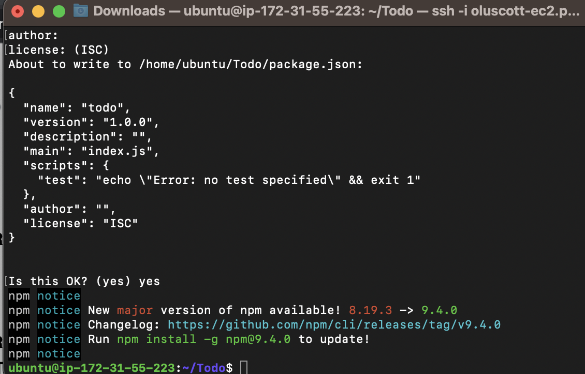
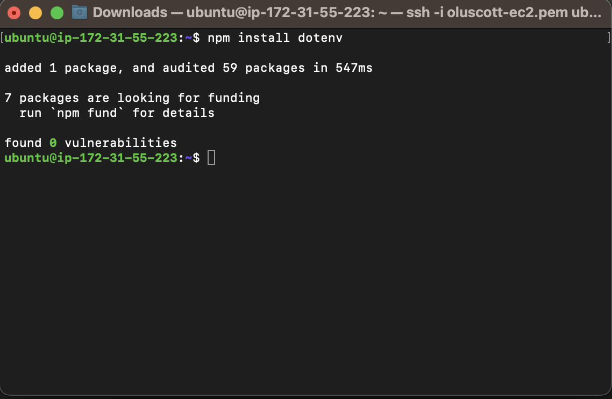
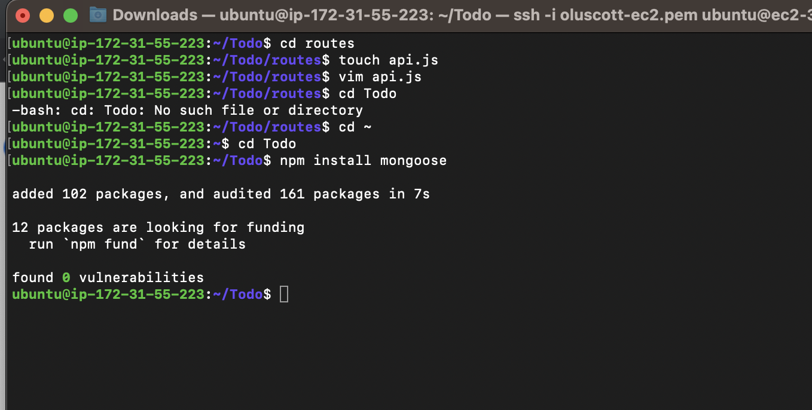
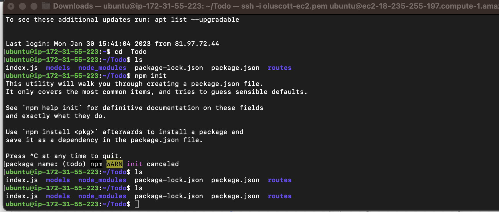
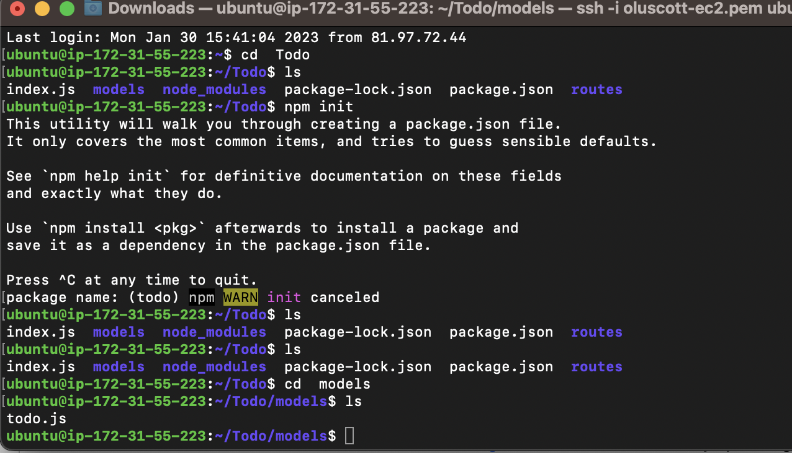
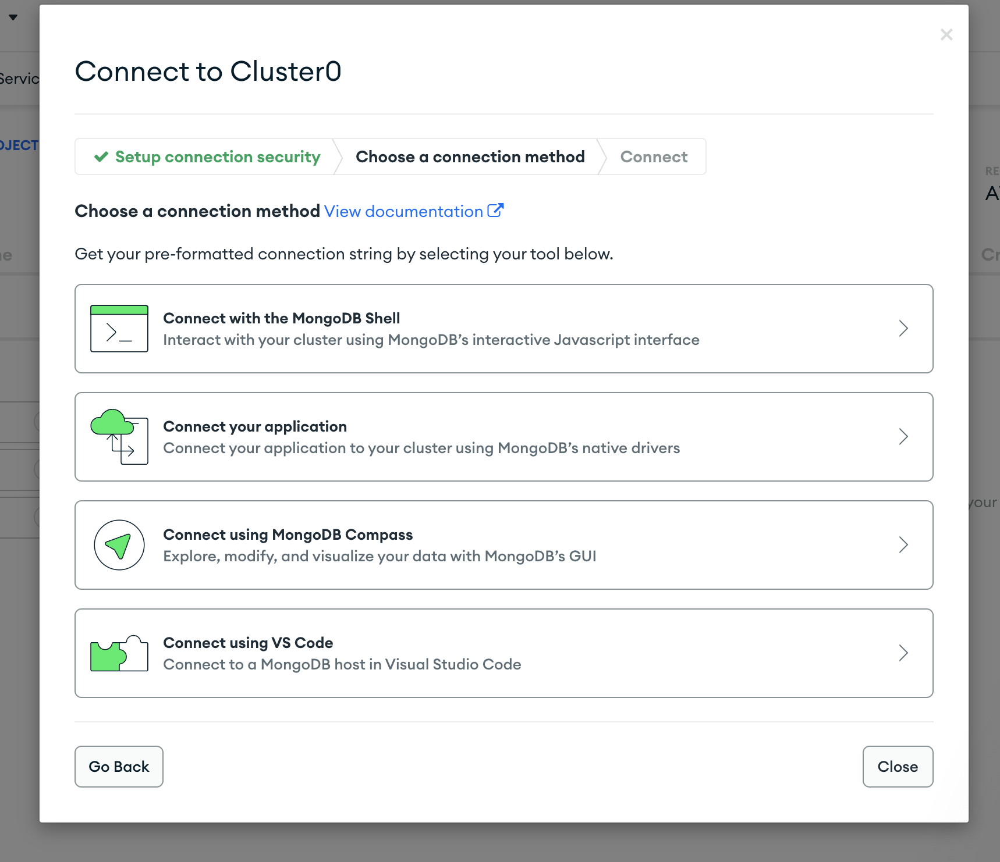
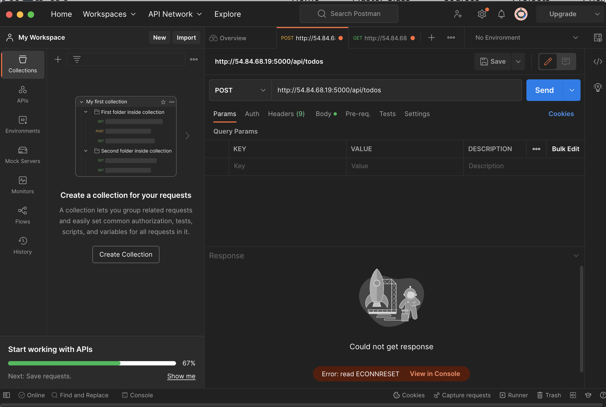
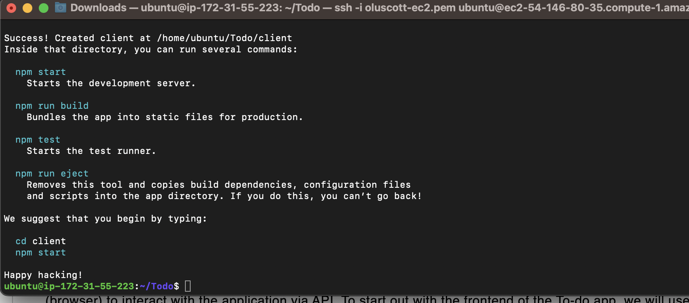
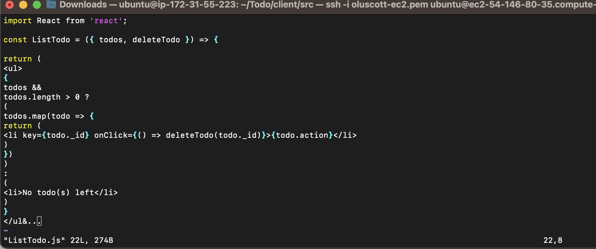

## **MERN STACK IMPLEMENTATION**

### **BACKEND CONFIGURATION**

`sudo apt update`

`sudo apt upgrade`

`curl -fsSL https://deb.nodesource.com/setup_18.x | sudo -E bash -`

**Install Node.js on the server**

`sudo apt-get install -y nodejs`

`node -v `

`npm -v `

**Create a new directory for your To-Do projec**

`mkdir Todo`

`cd Todo`

`npm init`

.[Ubuntu repositories](https://github.com/nodesource/distributions#deb)

.[NPM](https://www.npmjs.com/)

### **INSTALL EXPRESSJS**

`npm install express`

`touch index.js` 

`npm install dotenv`

### **MODELS**

**Install Mongoose**

`npm install mongoose`

**Create a new folder models**

`mkdir models`

`cd models`

`touch todo.js`

### **MONGODB DATABASE**

**Create a file in your Todo directory and name it .env.**

`touch .env`
`vi .env`

**Start your server using the command**

### **Install Postman**

### **FRONTEND CREATION**

`npx create-react-app client`

`cd src/components`

`vi ListTodo.js`

xxs