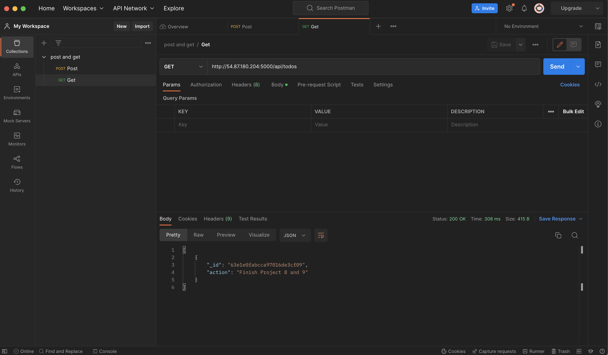

## **MERN STACK IMPLEMENTATION**

### **BACKEND CONFIGURATION**

`sudo apt update`

`sudo apt upgrade`

`curl -fsSL https://deb.nodesource.com/setup_18.x | sudo -E bash -`

**Install Node.js on the server**

`sudo apt-get install -y nodejs`

`node -v `

`npm -v `

**Create a new directory for your To-Do projec**

`mkdir Todo`

`cd Todo`

`npm init`

.[Ubuntu repositories](https://github.com/nodesource/distributions#deb)

.[NPM](https://www.npmjs.com/)

### **INSTALL EXPRESSJS**

`npm install express`

`touch index.js` 

`npm install dotenv`

### **MODELS**

**Install Mongoose**

`npm install mongoose`

**Create a new folder models**

`mkdir models`

`cd models`

`touch todo.js`

### **MONGODB DATABASE**

**Create a file in your Todo directory and name it .env.**

`touch .env`
`vi .env`

**Start your server using the command**

### **Install Postman**

### **FRONTEND CREATION**

`npx create-react-app client`

`npm install concurrently --save-dev`

`npm install nodemon --save-dev`

open the package.json file

`npm run dev`

`cd src/components`

`vi ListTodo.js`

#### **FRONTEND CREATION**

`npx create-react-app client`

`npm install concurrently --save-dev`

`npm install nodemon --save-dev`

`npm run dev`

[MONGODB](https://www.mongodb.com/)

[Express](https://expressjs.com/)

[React](https://reactjs.org/)

[Node.js](https://nodejs.org/en/)

[DBMS](https://www.alooma.com/blog/types-of-modern-databases)

[Webapplication](https://en.wikipedia.org/wiki/Web_framework)

[javascript](https://www.w3schools.com/js/js_intro.asp)

[Restful](https://restfulapi.net/)

[CSS](https://en.wikipedia.org/wiki/CSS)

